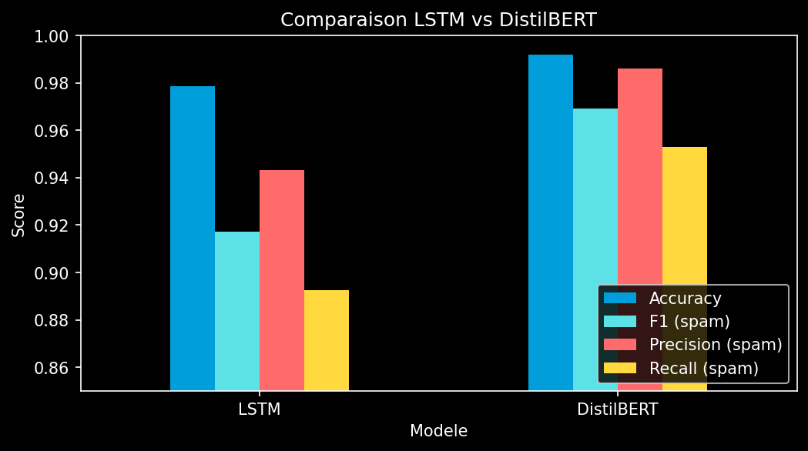

# AT&T Spam Detector -- Détection automatique de SMS spam

[](#)
[](#)
[](#)
[](#)
[](#)

---

## About

AT&T, leader américain des télécoms, souhaite automatiser la détection de SMS spam pour protéger ses utilisateurs. Ce projet construit deux modèles de deep learning capables de classifier un SMS en **spam** ou **ham** (légitime) à partir de son contenu textuel :

- un **LSTM bidirectionnel** entraîné from scratch ;
- un **DistilBERT** fine-tuné par transfer learning.

Projet réalisé dans le cadre du **BLOC 4 -- Deep Learning** du bootcamp JEDHA.

---

## Dataset

| Propriété | Valeur |
|-----------|--------|
| Source | [SMS Spam Collection](https://full-stack-bigdata-datasets.s3.eu-west-3.amazonaws.com/Deep+Learning/project/spam.csv) |
| Taille | 5 572 SMS |
| Classes | ham (4 825, 87%) / spam (747, 13%) |
| Langue | Anglais |

Le dataset est déséquilibré : seulement 13% de spam. Le F1-score sur la classe spam est donc la métrique principale.

---

## Installation

```bash
git clone https://github.com/athanormark/AT-T-BLOC-4_JEDHA_FORMATION.git
cd AT-T-BLOC-4_JEDHA_FORMATION
pip install -r requirements.txt
```

Télécharger le dataset dans `data/` :

```bash
mkdir data
curl -o data/spam.csv "https://full-stack-bigdata-datasets.s3.eu-west-3.amazonaws.com/Deep+Learning/project/spam.csv"
```

Lancer le notebook :

```bash
jupyter notebook notebook/att_spam_detector.ipynb
```

---

## Pipeline

### 1. EDA et nettoyage

- Distribution des classes : 4 825 ham vs 747 spam (ratio 6.5:1).
- Les spams sont en moyenne plus longs que les messages légitimes.
- Nettoyage appliqué au LSTM : lowercase, suppression des URLs et caractères spéciaux, normalisation des espaces. BERT utilise les textes bruts (son tokenizer gère la ponctuation et les majuscules).

### 2. Preprocessing

| Étape | Méthode | Justification |
|-------|---------|---------------|
| Split | 80/20 stratifié | Conserve le ratio spam/ham dans chaque set |
| Vocabulaire (LSTM) | Construit sur le train uniquement | Évite le data leakage |
| Tokenisation (BERT) | Tokenizer DistilBERT (WordPiece) | Textes bruts, BERT gère son propre preprocessing |
| Padding | MAX_LEN = 150 (LSTM) / 128 (BERT) | Couvre la quasi-totalité des messages |

### 3. Modélisation

**Modèle 1 -- LSTM bidirectionnel (from scratch)**

- Embedding 128 dims, LSTM 2 couches bidirectionnelles, global average pooling, dense.
- BCEWithLogitsLoss avec pos_weight = 3.0 pour compenser le déséquilibre.
- Adam (lr = 2e-3) + StepLR scheduler + gradient clipping.
- 20 epochs, ~640 000 paramètres.

**Modèle 2 -- DistilBERT (transfer learning)**

- Modèle pré-entraîné sur un large corpus anglais (66M paramètres).
- Freeze des embeddings + 4 premières couches transformer (22% des paramètres entraînés).
- AdamW (lr = 2e-5), 3 epochs.

### 4. Évaluation

- **F1-score** : métrique principale car le dataset est déséquilibré.
- **Precision** : important pour ne pas filtrer de vrais messages (faux positifs).
- **Recall** : important pour détecter un maximum de spams (faux négatifs).

---

## Résultats

| Modèle | Accuracy | F1 (spam) | Precision (spam) | Recall (spam) |
|--------|----------|-----------|-------------------|---------------|
| LSTM bidirectionnel | 97.85% | 0.917 | 0.943 | 0.893 |
| **DistilBERT** | **99.19%** | **0.969** | **0.986** | **0.953** |

DistilBERT surpasse le LSTM sur toutes les métriques. Le transfer learning est particulièrement efficace ici car le dataset est petit (5 572 exemples).



---

## Limites

- Dataset réduit : 5 572 SMS seulement, ce qui limite la capacité de généralisation, en particulier pour le LSTM entraîné from scratch.
- Langue unique : le dataset ne contient que des SMS en anglais. Le modèle n'est pas applicable tel quel aux SMS en français ou dans d'autres langues.
- Seuil de classification fixe : le seuil par défaut de 0.5 est utilisé sans optimisation. Un ajustement du seuil pourrait améliorer le compromis precision/recall selon les priorités métier.
- Pas de data augmentation : aucune augmentation de données n'a été appliquée. Le transfer learning compense partiellement ce manque, mais l'ajout de données synthétiques pourrait renforcer la robustesse.
- Évolution des spams : les techniques de spam évoluent en permanence. Le modèle entraîné sur des données statiques pourrait perdre en efficacité face à de nouvelles formes de spam.

---

## Recommandations pour AT&T

- Déployer le modèle DistilBERT en production : ses performances (F1 = 0.969, precision = 0.986) garantissent un filtrage fiable avec très peu de faux positifs (2 messages légitimes bloqués sur 1 000).
- Ajouter le support multilingue : fine-tuner un modèle multilingue (ex. : mBERT, XLM-RoBERTa) pour couvrir les SMS en français, espagnol et autres langues du réseau AT&T.
- Mettre en place un retraining périodique : réentraîner le modèle régulièrement sur les nouveaux SMS signalés comme spam pour maintenir la performance.
- Optimiser le seuil de décision : ajuster le seuil de classification en fonction des priorités métier.
- Intégrer une boucle de feedback utilisateur : permettre aux utilisateurs de signaler les faux positifs et faux négatifs pour alimenter le pipeline de retraining.

---

## Conclusion

Le projet répond à la problématique AT&T : **automatiser la détection de SMS spam par deep learning**.

DistilBERT (transfer learning) surpasse le LSTM (from scratch) sur toutes les métriques : F1 0.969 vs 0.917, precision 0.986 vs 0.943, recall 0.953 vs 0.893. En production, sur 1 000 SMS reçus, DistilBERT ne filtrerait que 2 messages légitimes à tort et laisserait passer 6 spams. Le transfer learning est l'approche optimale sur un petit dataset (5 572 exemples) : DistilBERT converge en 3 epochs contre 20 pour le LSTM, et sans overfitting.

Bonnes pratiques appliquées : split stratifié avant toute transformation (pas de data leakage), F1-Score comme métrique principale (dataset déséquilibré 87/13), pos_weight pour compenser le déséquilibre, seed fixe pour la reproductibilité.

---

## Structure du projet

```
.
├── notebook/
│   └── att_spam_detector.ipynb   # Notebook principal
├── data/
│   └── spam.csv                  # Dataset
├── _bert_results.json            # Métriques DistilBERT
├── _lstm_results.json            # Métriques LSTM
├── requirements.txt
└── README.md
```

---

## Auteur

Athanor SAVOUILLAN · [GitHub](https://github.com/athanormark)
